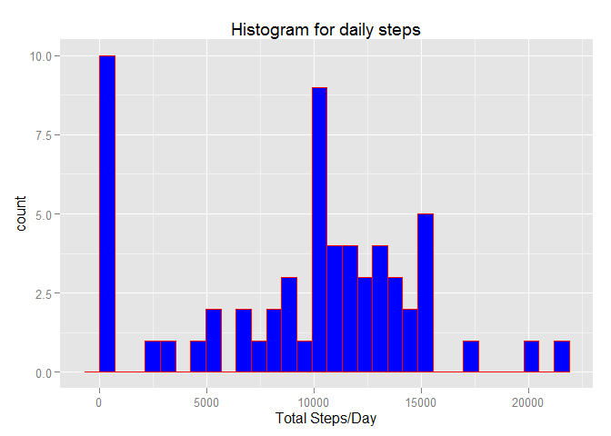
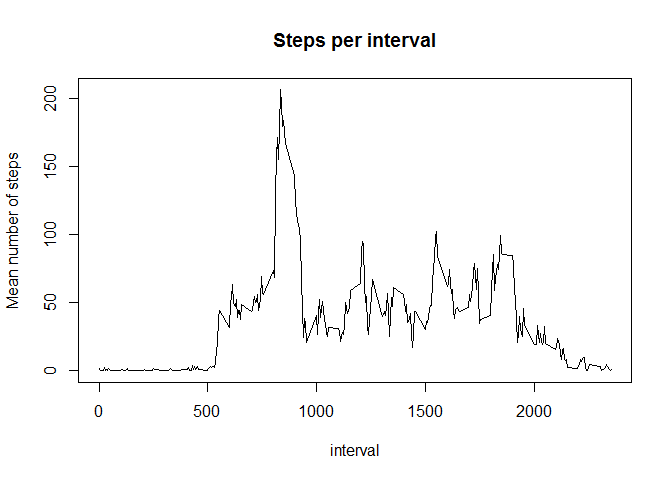
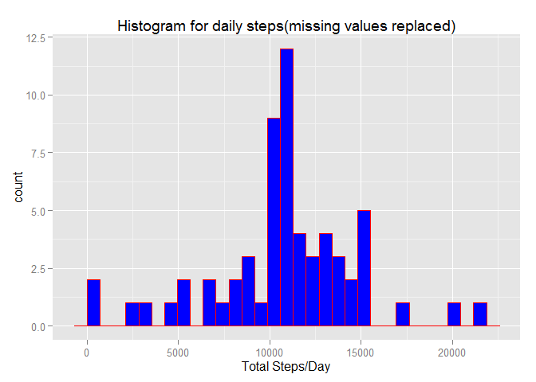
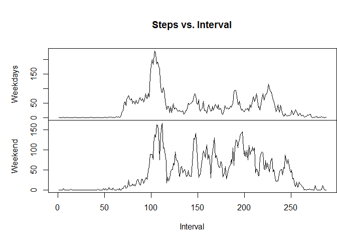

# Reproducible Research: Peer Assessment 1


## Loading and preprocessing the data

```r
data = read.csv(file=unzip("activity.zip"))
```
## What is mean total number of steps taken per day
We do this  analysis  by plotting an histogram of the number of steps per days in ggplot, and calculating the mean and median of steps per days.


```r
summary(data)
```

```
##      steps                date          interval     
##  Min.   :  0.00   2012-10-01:  288   Min.   :   0.0  
##  1st Qu.:  0.00   2012-10-02:  288   1st Qu.: 588.8  
##  Median :  0.00   2012-10-03:  288   Median :1177.5  
##  Mean   : 37.38   2012-10-04:  288   Mean   :1177.5  
##  3rd Qu.: 12.00   2012-10-05:  288   3rd Qu.:1766.2  
##  Max.   :806.00   2012-10-06:  288   Max.   :2355.0  
##  NA's   :2304     (Other)   :15840
```

```r
library(ggplot2)
step_summary = tapply(data$steps,data$date,sum,na.rm=T)
qplot(step_summary,
      geom="histogram",
      main = "Histogram for daily steps", 
      xlab = "Total Steps/Day",  
      fill=I("blue"), 
      col=I("red"))
```

```
## stat_bin: binwidth defaulted to range/30. Use 'binwidth = x' to adjust this.
```

 

```r
mean_steps= mean(step_summary)
median_steps=median(step_summary)
```
The mean number of steps per days, ignoring missing data, is 9354.2295082 and the median number is 10395 .

## What is the average daily activity pattern?
The average daily pattern plot is exolained here.

```r
unique_interval = unique(data$interval)
steps_per_interval = tapply(data$steps, data$interval, mean, na.rm=T)
plot(unique_interval, steps_per_interval, type='l',
     main="Steps per interval",
     xlab="interval",
     ylab="Mean number of steps")
```

 

```r
max_interval = names(which.max(steps_per_interval))
```
835 is the one with a maximum averaged number of steps.

## Imputing missing values

The missing values are replaced by mean value of the same time interval across all days.

```r
index = is.na(data$steps)
total=sum(index)
nonulldata <- data
nonulldata$steps[which(index)] <- steps_per_interval[match(data$interval[which(index)], names(steps_per_interval))]

steps_per_day.nonull <- tapply(nonulldata$steps, nonulldata$date, sum, na.rm=T)
qplot(steps_per_day.nonull,
      geom="histogram",
      main = "Histogram for daily steps(missing values replaced)", 
      xlab = "Total Steps/Day",  
      fill=I("blue"), 
      col=I("red"))
```

```
## stat_bin: binwidth defaulted to range/30. Use 'binwidth = x' to adjust this.
```

 

```r
mean_steps_per_days<- mean(steps_per_day.nonull)
median_steps_per_days<- median(steps_per_day.nonull)
```

The number of missing values is` r total`. 
The mean number of steps per days, after remplacing missing data, is 1.0766189\times 10^{4} and the median number is 1.0766189\times 10^{4}. when we account for the missing values, it did change slightly the data, but not drastically.

## Are there differences in activity patterns between weekdays and weekends?

```r
nonulldata$day <- as.POSIXlt(nonulldata$date,format="%Y-%m-%d")$wday
nonulldata$day[nonulldata$day == 0] <- "weekend"
nonulldata$day[nonulldata$day == 6] <- "weekend"
nonulldata$day[nonulldata$day != "weekend"] <- "weekday"
nonulldata$day <- factor(nonulldata$day)

steps_per_interval1 <- with(nonulldata, tapply(steps, list(interval, day), mean))

par(mfrow = c(2,1))
with(nonulldata, {
  par(mai=c(0,1,1,0))
  plot(steps_per_interval1[,"weekday"], type="l", main=("Steps vs. Interval"), xaxt='n', ylab="Weekdays")
  par(mai=c(1,1,0,0))
  plot(steps_per_interval1[,"weekend"], type="l",xlab="Interval",ylab="Weekend")
})
```

 


We can see on the plot that the steps looks more distributed during weekend than during weekdays.
